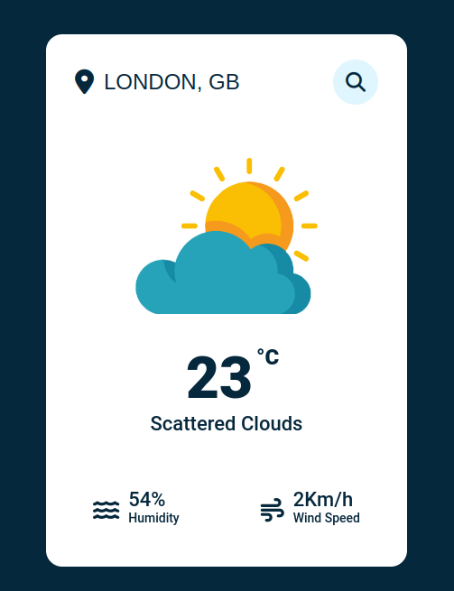

# Weather App

<div align="justify">
Essa é uma aplicação que tem como funcionalidade realizar buscas de cidades e apresentar seu clima, como temperatura, humidade e velocidade dos ventos. Essa aplicação utiliza a API disponibilizada pelo site [Open Weather Map](https://openweathermap.org/). O intuito desse projeto é de afiar minhas práticas de front-end tais como HTML, CSS e Javascript e a aplicação de chaves de API para o funcionamento de operações.
</div>
<br></br>

## Aviso

<div align="justify">
Você precisará adquirir sua própria chave de API no site citado acima, realizando login, copiando a chave e substituindo pela sua própria no arquivo index.js na linha 9 :

```javascript
const APIKey = 'Your Api Key';
```
</div>

# Ilustração
Aqui está uma ilustração da aplicação em funcionamento :


